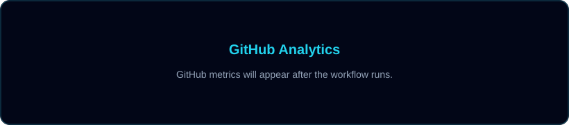
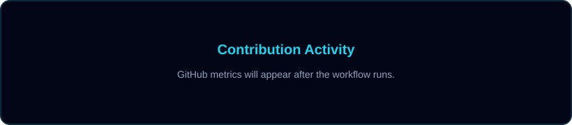
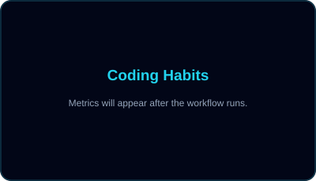

  

  

### A little about me

- 🧑‍💻 Building practical products across **backend, web, and mobile**.
- 🧠 Focused on **Data Science, Machine Learning, and applied AI**.
- ⚙️ Working with **Java, Spring Boot, JavaScript, TypeScript, React, and Next.js**.

 

<h3 align="center">Connect with me 🤝</h3>

  
  
  
  
  

---

## 🛠️ Technologies I Use

  
  
  
  
  
  
    
  
  
  
  
  
  
  
  
  
  

---

## 📊 Development Overview

  

## 📅 A Year in Code

  

## 🔍 Code Insights

  
  

## 🐍 Contribution Journey

  <picture>
    <source media="(prefers-color-scheme: dark)" srcset="./github-contribution-grid-snake-dark.svg" />
    <source media="(prefers-color-scheme: light)" srcset="./github-contribution-grid-snake.svg" />
    
  </picture>

## ⏱️ This Week in Code

<!--START_SECTION:waka-->

_WakaTime statistics will appear after the workflow runs._

<!--END_SECTION:waka-->

## 🤝 Get in Touch

  <a href="https://portfolio.tranvanhuy.io.vn">Portfolio</a> ·
  <a href="mailto:tranvanhuy064206@gmail.com">Gmail</a> ·
  <a href="https://www.linkedin.com/in/huy-tran-van-5753b13b4?utm_source=share_via&amp;utm_content=profile&amp;utm_medium=member_ios">LinkedIn</a> ·
  <a href="https://www.facebook.com/share/1DoSNJVqv3/?mibextid=wwXIfr">Facebook</a>

